# UAS-PM-JenshinWiki

- Dibuat untuk kepentingan **Ujian Akhir Semester Pemrograman Mobile**.
- Dibuat bersama kelompok (Ferry, Felix, Kelvin, Reynaldo)
- Menampilkan daftar Item dan Monster, serta dengan detail informasinya.
- Mengelolah pengguna yang terdaftar.
- Autentikasi & Otorisasi pengguna.

Website ini dibuat menggunakan teknologi :
**_Android, Java, PHP, MySQL_**

# Tampilan Aplikasi

|          Splash Screen           |             Register             |
| :------------------------------: | :------------------------------: |
| 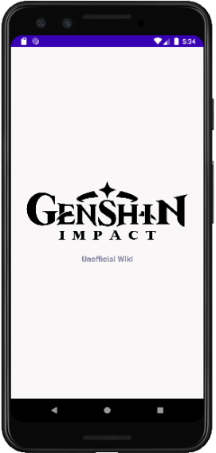 | 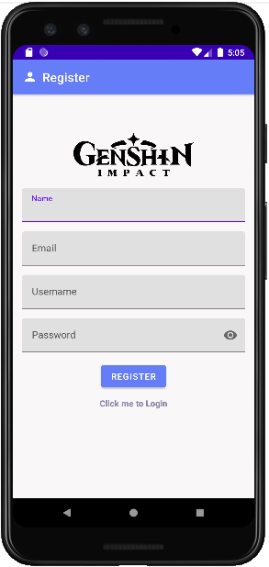 |

|              Login               |               Home               |
| :------------------------------: | :------------------------------: |
| 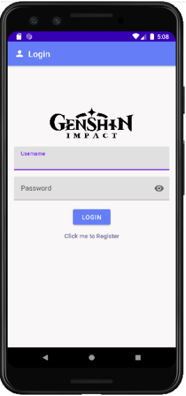 | 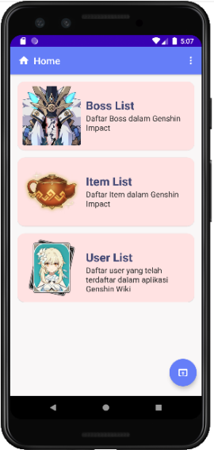 |

|          Daftar Monster          |          Update Monster          |
| :------------------------------: | :------------------------------: |
| 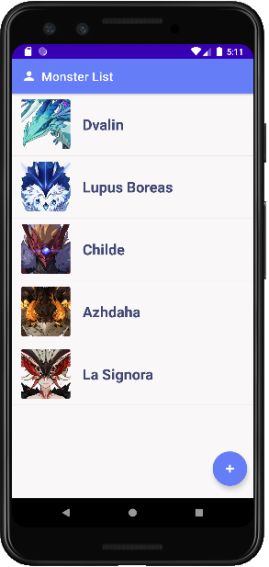 | 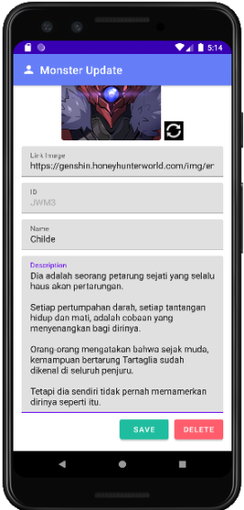 |

|           Daftar Item            |           Tambah Item            |            Update Item            |
| :------------------------------: | :------------------------------: | :-------------------------------: |
| 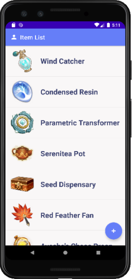 | 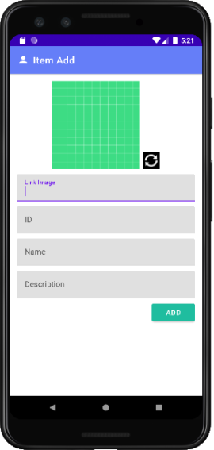 | 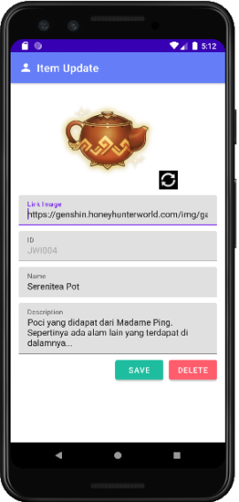 |

|          Daftar Pengguna          |          Update Pengguna          |
| :-------------------------------: | :-------------------------------: |
| 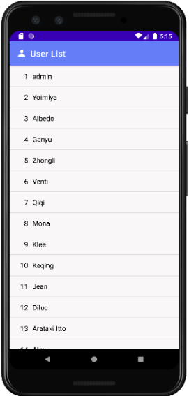 | 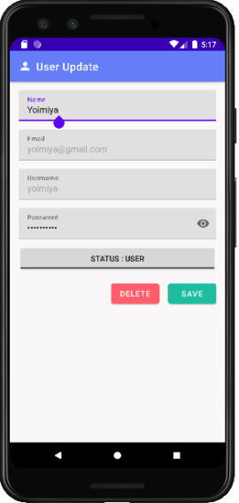 |
